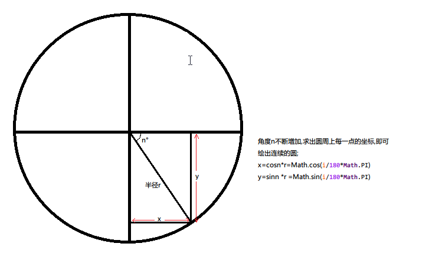

使用lineto()方法画圆.
	动态的计算出圆周上每一点的坐标作为lineto()的坐标,半径是固定的,角度由0递增至360度.根据递增的角度的cos和sin值以及半径即可计算出每一点的坐标,将其添加到for循环中即可.

```
	ctx.beginPath();
	for(var i=0;i<deg;i++){
		var angel = i/180*Math.PI;
		var x = r*Math.cos(angel);
		var y = r*Math.sin(angel);
		ctx.lineTo(x,y);
	};
	ctx.stroke();
```