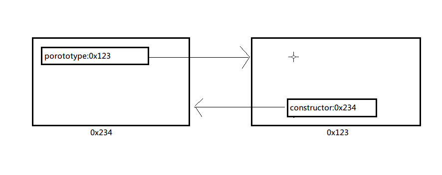

##原型与原型链

###显式原型 `prototype对象`
1. `函数`的prototype属性(图)
  * 每个函数都有一个prototype属性, 即显式原型,它默认指向一个`对象`(即称为: 原型对象)
  * 原型对象中有一个属性constructor, 它指向`函数对象`
2. 给函数原型添加属性(一般都是方法)
  * 作用: 函数的所有实例对象都能访问原型中的属性(方法)
```
function Person(name, age){
		this.name = name;
		this.age = age;
}
Person.prototype.sayName = function(){
		console.log(this.name);
}
var p1 = new Person('Tom', 12);
p1.sayname()			//tom
```



###隐式原型 `__proto__`
1. 每个`函数`function都有一个prototype原型对象
2. 每个`实例对象`都有一个`__proto__`，可称为隐式原型
3. 对象的隐式原型的值为其对应构造函数的显式原型的值
	`实例的__proto__===构造函数的prototype`
	此时用这个`实例 instanceof 构造函数`就将返回true
4. 内存结构(图)


5. 总结:
  * 函数的prototype属性: 在定义函数时自动添加的, 默认值是一个空对象
  * 对象的`__proto__`属性: 创建对象时自动添加的, 默认值为构造函数的prototype属性值
  * 程序员能直接操作显式原型, 但不能直接操作隐式原型(ES6之前)
  

###读/写一个对象的属性
- 读:
	js引擎首先在该对象内部找,找到则返回,否则下一步;
	沿着该对象的`__proto__`向上找到该对象的构造函数的prototype对象,找到则返回,否则下一步;
	沿着prototype对象的`__proto__`向上找到Object函数的prototype对象,找到则返回,否则下一步;
	Object.prototype的`__proto__`值为null,返回错误;

- 写:
	首先在该对象内部查找是否有这个属性,如果有,则将它的值设为新值,没有,则新建这个属性,不会去看`__proto__`;