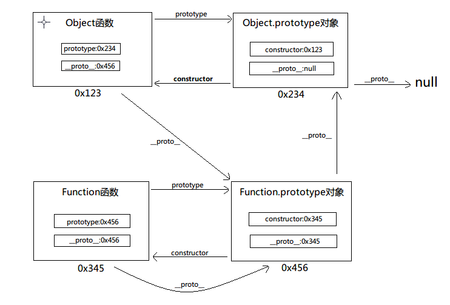
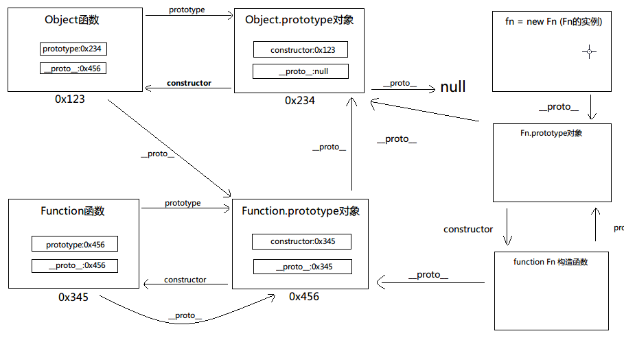

##定理:
- 所有函数都有原型对象,所有原型对象都是Object函数的实例;
- 所有函数都是Function的实例,包括Object函数和Function函数本身;

##规则:
- 函数的prototype属性指向它的原型对象,这个原型对象的constructor属性指向这个函数;
- 实例的`__proto__`指向它的构造函数
- 对象没有prototype属性;

##推论
	
- 在程序运行之前,Function函数Object函数已经被初始化;
	Funtion函数的prototype属性指向它的prototype对象;
	Fun.`__proto__`指向自己的prototype对象;
	Fun.prototype对象的`__proto__`指向Object函数的prototype对象;
	Object函数的prototype属性指向它的prototype对象;
	Obj.`__proto__`指向Function的prototype对象;
	Obj.prototype对象的`__proto__`指向null;

- 创建一个函数Fn时,在栈内存内创建一个名为Fn的变量,值为指向堆内存中该函数对象的地址;
	Fn是Function函数的实例,它的`__proto__`属性,值为Function.prototype对象的内存地址;
	Fn有一个prototype属性,值为一个空对象的内存地址;
	Fn.prototype是Object函数的实例,它的`__proto__`属性,值为Object.prototype对象的内存地址;

- 使用Fn创建一个新的对象fn,栈内存内创建名为fn的变量,值为堆内存中该函数对象的地址;
	fn的`__proto__`指向Fn.prototype对象;

---
