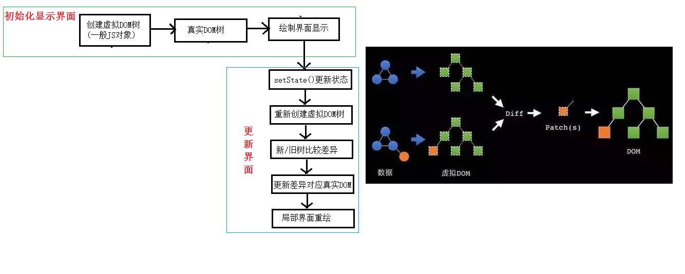

#React

react是facebook的一个开源JS库,为解决更新界面频繁操作DOM带来效率低下的问题,react创建了虚拟DOM(virtualDOM)这一概念;

每一个DOM都包含大量数据,是非常重的对象,而其中很多属性都不是我们当前要操作的目标.react构建一个轻量级的虚拟DOM,与真实DOM映射,当页面需要进行频大量更新时,首先对虚拟DOM进行更新,然后将最终结果与真实DOM同步,最大程度地减少页面重绘的次数.


##相关js库
react.js:react核心库
react-dom,js:操作DOM的扩展库
banbel.js:解析jsx语法的工具包

##JSX
react提供了一种特别的语法,一种类似XML标签的js扩展语法,这就是jsx语法(javescript XML)
示例: `var RDom = <h1>hello react<h1>`

在jsx语法中,上面的代码是合法的,RDom的值是实际上是一个虚拟DOM对象,它本质是是一个普通的js对象,`注意不要写成字符串`
- 虚拟DOM对象的标签名,属性名都可以任意写,如果是html同名标签,将其转为html元素,否则另作处理;
- 标签内的js代码必须使用{}包裹
- 标签的class属性改写为className
- 标签的style属性内必须为一个对象({{color:'red'}})

jsx语法不受浏览器支持,必须使用babel将其转换为js代码才能被浏览器识别,使用jsx语法必须使用babel相关插件

虚拟DOM也不能被浏览器直接识别,必须使用ReactDOM对象的render()方法才能渲染同步相应的真实DOM对象,更新页面,所以还必须引入react-dom包

##虚拟DOM
虚拟DOM是一个普通的js对象,它具有与真实DOM类似的层次关系和一些基本属性
`tip:如果只是更新虚拟DOM,页面不会重绘`
虚拟DOM的一般场景
* 初始化显示: 
	>创建虚拟DOM(JS对象)树
	>关联同步真实DOM树
	>绘制界面并显示
* 更新界面: 
	>setState()更新状态
	>重新创建虚拟DOM树
	>对新树和旧树进行比较得到差异(dom diff)
	>更新变化的虚拟DOM对应的真实DOM(局部更新)
	>重绘局部界面



```
tip:
类比CPU,内存,硬盘的关系;
cpu的速度太快,而硬盘太慢,所以在二者中间的内存中建立缓存,在内存中进行数据的加工,然后将最终结果保存在硬盘中;
js,react和DOM之间的关系也类似,react相当于js和DOM之间的缓存,可以提高页面渲染的效率;
```
